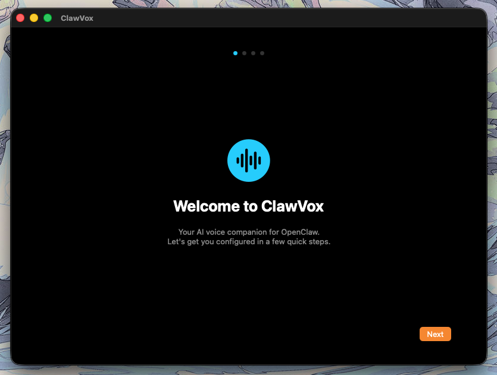
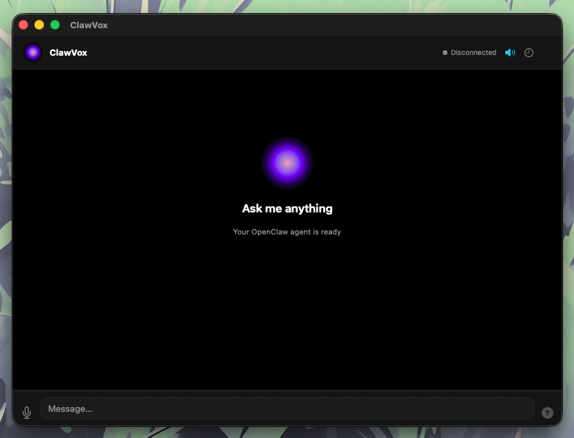

# ClawVox

<p align="center">
  
  
</p>

A native macOS companion app — think Iron Man's Jarvis — that connects to a locally-running [OpenClaw](https://github.com/open-claw/openclaw) agent via REST and WebSocket, adding a persistent menu bar presence, voice I/O, and a conversational chat window.

## Features

- **Voice in / Voice out** — speak to your agent and hear it respond. On-device by default (Apple Speech + AVSpeechSynthesizer), with optional cloud providers (ElevenLabs, OpenAI Whisper/TTS) for higher quality.
- **Streaming chat** — responses stream token-by-token over WebSocket, displayed in a minimal dark-themed chat window with an animated orb visualizer.
- **Menu bar integration** — always-accessible menu bar icon with a quick-access popover, mute toggle, connection status, and settings shortcut.
- **Secure credential storage** — API keys and auth tokens live in the macOS Keychain, never in plaintext.
- **Private by default** — all STT and TTS run on-device unless you opt in to a cloud provider. No telemetry.

## Tech Stack

| Concern | Technology |
|---|---|
| UI framework | SwiftUI (macOS 13+) |
| State management | Combine (`@Published`, `ObservableObject`) |
| Networking | `URLSession` (REST) + `URLSessionWebSocketTask` (streaming) |
| Speech-to-text | Apple Speech framework — on-device |
| Text-to-speech | `AVSpeechSynthesizer` — on-device by default |
| Cloud TTS (optional) | ElevenLabs |
| Secrets | macOS Keychain via `Security.framework` |
| Project generation | [XcodeGen](https://github.com/yonaskolb/XcodeGen) |

## Requirements

- macOS 13 Ventura or later
- A running [OpenClaw](https://github.com/open-claw/openclaw) instance (default: `localhost:18789`)
- Xcode 15+ (to build from source)

## Installation

### Option 1 — Pre-built installer

Download the latest `.pkg` from the [Releases](../../releases) page and run it. The installer places `ClawVox.app` in `/Applications`.

### Option 2 — Build from source

**Prerequisites:** Xcode 15+, [XcodeGen](https://github.com/yonaskolb/XcodeGen)

```bash
# Install XcodeGen if you don't have it
brew install xcodegen

# Clone the repo
git clone https://github.com/open-claw/clawvox.git
cd clawvox

# Generate the Xcode project
xcodegen generate

# Build
xcodebuild -scheme "ClawVox" -destination 'platform=macOS' build
```

Or open `ClawVox.xcodeproj` in Xcode and press `Cmd+R`.

## Running

1. Start your OpenClaw agent (listens on `localhost:18789` by default).
2. Launch `ClawVox.app` — it appears in your menu bar, not the Dock.
3. On first launch, complete the onboarding wizard to enter your OpenClaw URL and (optional) bearer token.
4. Click the menu bar icon to open the chat window. Speak or type to interact.

## Project Structure

```
ClawVox/
├── Views/          # SwiftUI views — no business logic
├── ViewModels/     # @MainActor ObservableObjects — orchestrate services
├── Models/         # Plain value types (Codable structs/enums)
├── Networking/     # REST + WebSocket clients
├── Services/       # Keychain, Speech, TTS integrations
└── Utilities/      # Constants, extensions
```

## Regenerating the Xcode Project

After adding new source files or changing build settings, regenerate with:

```bash
xcodegen generate
```

Commit both `project.yml` and the updated `ClawVox.xcodeproj/project.pbxproj`.

## License

See [LICENSE.md](LICENSE.md).
